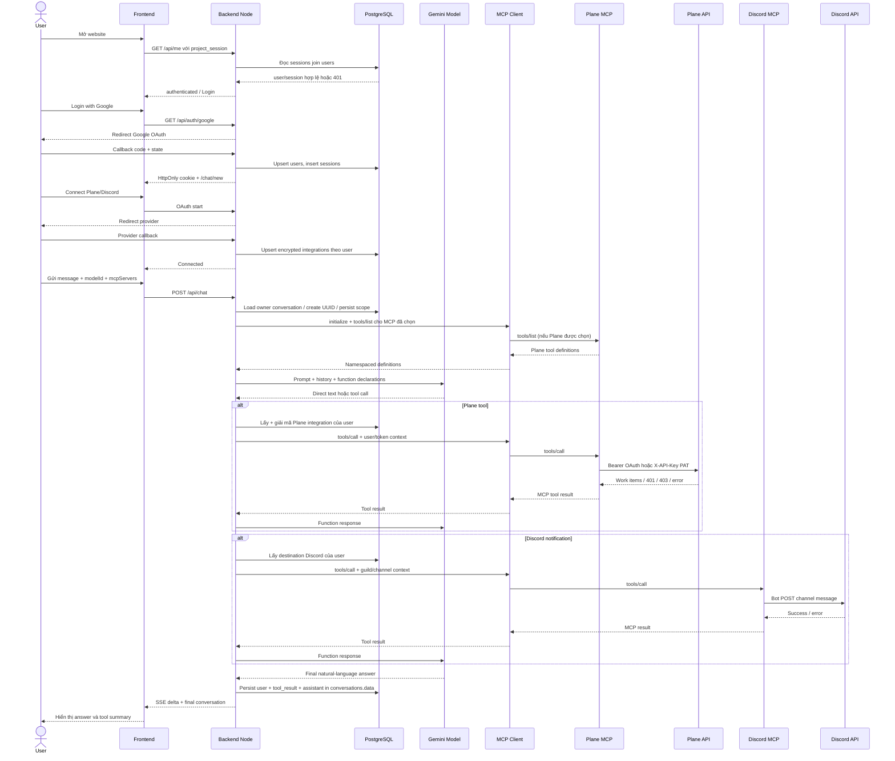
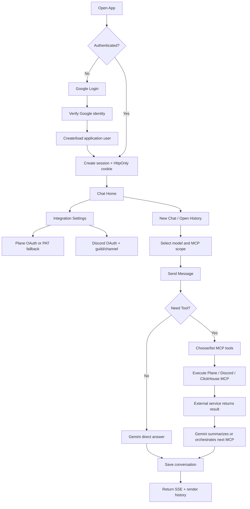

# Project User Flow

Tài liệu này mô tả hành vi của project `MCPServer` theo góc nhìn người dùng cuối, dựa trên source hiện tại trong `be`, `fe`, `PlaneMCPServer`, `DiscordMCPServer` và `mcp-clickhouse`. Các file build/cache và mô tả trong plan không được coi là bằng chứng cho một chức năng đã hoàn tất.

> Phạm vi: project mode hiện tại. `fe/src/config/project.ts` đặt `PROJECT_USER_MODE = true`, nên luồng bên dưới đi qua màn hình chat riêng và backend `be`; không phải toàn bộ giao diện LibreChat legacy.

## 1. System Overview

Người dùng nhìn thấy một ứng dụng chat nội bộ. Frontend được phục vụ ở cổng 3090 và gửi các request `/api/*` tới backend Node ở cổng 3091 qua Vite proxy (`fe/vite.config.ts`). Backend xác thực session, đọc/ghi PostgreSQL, gọi Gemini trực tiếp, phát hiện tool MCP và điều phối các MCP server. Credential của Plane/Discord không đi xuống browser.

Luồng chính là:

```text
Mở app → kiểm tra project_session → Google Login nếu cần → Chat Home
→ chọn model/MCP → gửi câu hỏi → backend gọi Gemini
→ Gemini trả lời trực tiếp hoặc gọi MCP tool
→ MCP server gọi Plane/Discord/ClickHouse → Gemini tổng hợp
→ backend lưu conversation → frontend hiển thị
```

Các thành phần và trách nhiệm:

| Thành phần | Trách nhiệm thực tế |
|---|---|
| User | Đăng nhập, chọn model/MCP, gửi yêu cầu, cấu hình integration. |
| Frontend | Render UI, giữ trạng thái tạm thời, gửi `conversationId`, `modelId`, `mcpServers`; không quyết định identity. |
| Backend Node | Xác thực session, ownership, model allowlist, persistence, Gemini function calling, chọn/ràng buộc tool, truyền execution context. |
| PostgreSQL | Lưu users, sessions, integrations và conversation JSONB. |
| Gemini | Quyết định trả lời hay phát sinh function call; có thể lặp nhiều vòng tool → model. |
| MCP Client | Khởi tạo session, `tools/list`, `tools/call`, parse JSON/SSE và áp timeout. |
| Plane MCP | Nhận context user/token từ backend và gọi Plane API cho workspace/project cấu hình trong MCP server. |
| Discord MCP | Dùng bot token chung để gửi vào channel mà backend truyền theo user. |
| ClickHouse MCP | Cung cấp các tool ClickHouse; hiện không có credential context theo user trong Node backend. |

Trace chính: `fe/src/App.jsx`, `fe/src/components/ProjectStandaloneApp.jsx`, `be/src/server.js`, `be/src/agentService.js`, `be/src/toolRegistry.js`, `be/src/mcpClient.js`.

## 2. First-time User Journey

1. User mở `http://localhost:3090`.
2. Frontend mount `ProjectAuthProvider`, gọi `GET /api/me` với `credentials: 'include'`.
3. Nếu cookie hợp lệ, app chuyển tới `/chat/new`. Nếu chưa có session hoặc session không hợp lệ, user thấy card **Internal Assistant – Sign in to continue** và nút **Continue with Google**.
4. Sau login thành công, user vào màn hình chat: rail bên trái, danh sách Chats, khung chat trung tâm, model selector, MCP selector/sidebar, utility sidebar bên phải và menu tài khoản.
5. User có thể mở Integration settings để kết nối Plane/Discord. Không có bước bắt buộc phải kết nối integration trước khi chat; chat không dùng tool vẫn có thể chạy nếu Gemini được cấu hình.

UI thực tế có: New Chat, Conversations/history, MCP Servers, Integration settings, model selector, theme, sign out, voice input, copy/edit/share message, context usage, quick actions và danh sách recent tĩnh. Nút copy/bookmark ở header hiện chỉ render, chưa có handler persistence.

## 3. Authentication Flow

### Đăng nhập

```text
User → Continue with Google
→ GET /api/auth/google
→ backend tạo state + nonce ngắn hạn
→ redirect Google OAuth
→ /api/auth/google/callback
→ đổi code lấy token, kiểm tra tokenInfo/audience/issuer/email_verified/nonce
→ find-or-create user theo Google subject
→ tạo session token ngẫu nhiên
→ lưu hash token vào sessions
→ trả HttpOnly cookie project_session
→ redirect /chat/new
```

Code liên quan: `fe/src/project-auth.jsx`, `be/src/server.js` (các route Google), `be/src/googleAuth.js`, `be/src/applicationAuth.js`, `be/src/auth.js`.

User không cần đăng nhập lại sau reload trong thời hạn session vì browser gửi lại cookie `project_session`. Session mặc định là 7 ngày (`AUTH_SESSION_TTL_MS=604800000`), có `expires_at`, `revoked_at`, và token thô không được lưu DB—chỉ lưu SHA-256 hash (`be/src/applicationAuth.js`). Hiện frontend không tự gọi `/api/auth/refresh` khi session hết hạn; request bị 401 và bootstrap tiếp theo sẽ đưa user về Login. Route refresh tồn tại ở backend (`POST /api/auth/refresh`) nhưng chưa được nối thành flow refresh tự động.

Logout: user mở avatar menu → **Sign out** → `POST /api/auth/logout` → revoke session trong DB → clear cookie → frontend đặt trạng thái unauthenticated.

Hai user được tách bằng `users.id` được tạo từ Google identity và `sessions.user_id`. Backend luôn lấy identity từ cookie/session đã verify (`req.user.id`), không tin `userId` do browser gửi.

## 4. Main Chat Flow

Sau khi đăng nhập, `ProjectStandaloneApp` tải song song:

- `GET /api/chat/models`: lấy model public từ `CHAT_MODEL_MAP_JSON`.
- `GET /api/chat/history`: lấy conversation thuộc user hiện tại.
- `GET /api/chat/mcp`: backend initialize/list tools từng MCP server để hiển thị trạng thái và tool count.
- `GET /api/chat/profile`: chỉ lấy email để hiện trong avatar menu.

Màn hình gồm:

- rail điều hướng;
- sidebar Chats, chia Today / Previous 7 days / Older;
- khung tin nhắn và composer;
- model selector;
- MCP server selector và checkbox chọn Plane/Discord/ClickHouse;
- nút test/refresh cho MCP;
- Settings cho Plane/Discord;
- utility sidebar với quick prompts và recent activities tĩnh.

`connectedCount` chỉ là trạng thái availability của MCP server, không có nghĩa Plane/Discord account của user đã OAuth-connected. Integration status chỉ hiển thị trong Settings.

## 5. Conversation Flow

Route thực tế là `/chat/:conversationId`, với màn hình mới tại `/chat/new` (`fe/src/App.jsx`).

### Tạo chat

User bấm New Chat → frontend xóa state message, reset selection và navigate `/chat/new`. **Không có record PostgreSQL được tạo tại thời điểm bấm nút.** Endpoint `POST /api/chat/conversations` có tồn tại và tạo UUID + record rỗng, nhưng UI hiện tại không gọi endpoint này.

Khi user gửi tin đầu tiên ở `/chat/new`, `POST /api/chat` tạo UUID nếu `conversationId` là null, tạo object gồm `id`, `ownerId`, `title` (80 ký tự đầu), `modelId`, `mcpServers`, `messages`, `createdAt`, rồi lưu vào bảng `conversations` trước khi gọi Gemini. Sau khi thành công, frontend nhận conversation và chuyển URL sang `/chat/{id}`.

### Mở/reload chat

Reload `/chat/{id}` → frontend gọi `GET /api/chat/conversations/{id}` → backend đọc record theo ID rồi kiểm tra `conversation.ownerId === req.user.id`. Nếu đúng, frontend restore messages, model và MCP selection. MCP selection được lưu thêm ở `localStorage` theo conversation ID để giữ lựa chọn trong cùng browser; DB là fallback khi mở lại browser/session khác.

User A không mở được URL của User B: route trả 404 nếu ownership không khớp. History cũng query `WHERE owner_id = userId`. Conversation nằm trong PostgreSQL, cột `data JSONB`; `owner_id` dùng để cô lập, `legacy_owner_id` hiện chỉ là cột tương thích và không được dùng trong flow mới.

Xóa history có route `DELETE /api/chat/history/{conversationId}` và kiểm tra ownership, nhưng UI project hiện không render nút xóa.

## 6. Plane Integration Flow

Trong Settings, user thấy **Plane – Connect Plane**.

### OAuth

Khi cấu hình đủ `PLANE_OAUTH_CLIENT_ID`, secret, authorize URL, token URL và redirect URI:

```text
User → Connect Plane
→ GET /api/integrations/plane/oauth/start
→ backend tạo state gắn với userId + provider
→ redirect Plane
→ user đăng nhập/cấp quyền
→ /api/integrations/plane/oauth/callback
→ backend consume state một lần
→ exchange authorization code
→ gọi Plane /api/v1/users/me/ để xác minh account
→ mã hóa access/refresh token và lưu integrations theo userId
→ redirect /chat/new?integration=plane&status=connected
→ Settings hiển thị Connected, account/workspace metadata
```

OAuth token có `expiresAt`; trước khi gọi tool, backend refresh nếu sắp hết hạn. Nếu refresh không được hoặc OAuth chưa cấu hình, user nhận yêu cầu reconnect.

### PAT fallback

Nếu OAuth chưa cấu hình, UI vẫn có **Advanced setup → Personal Access Token**. `POST /api/integrations/plane/connect` validate token bằng `GET {PLANE_BASE_URL}/api/v1/users/me/` với `X-API-Key`, phân biệt 401/403, rồi lưu loại credential `pat`. Đây là fallback có code thật, không phải OAuth giả lập.

Token được mã hóa AES-256-GCM trong `integrations.encrypted_credentials`; API status chỉ trả metadata, không trả token. User A lấy integration bằng user A; user B không thể dùng token của A.

### Giới hạn hiện tại

Plane MCP server đọc `Workspace` và `ProjectId` từ `PlaneMCPServer/appsettings.json`/environment, tức target workspace/project là cấu hình tĩnh của server. Token OAuth/PAT là của từng user và Plane vẫn là nơi quyết định quyền. UI không tự hiển thị role Owner/Admin/Member và backend không có permission matrix riêng.

## 7. Discord Integration Flow

### Kết nối và chọn destination

```text
User → Connect Discord
→ /api/integrations/discord/connect
→ Discord OAuth scope identify + guilds + bot
→ callback exchange code, lấy identity/guilds
→ lưu access/refresh token mã hóa theo user
→ Settings tải guilds bằng user OAuth token
→ chỉ giữ guild nơi bot chung có thể truy cập
→ user chọn server và channel
→ backend validate destination qua Discord MCP internal endpoint
→ lưu guildId/channelId vào integration của user
→ UI hiển thị Connected + server/channel
```

Trong khi lấy channels, service dùng bot token để chỉ trả text/announcement channel mà bot truy cập được. Destination validation kiểm tra guild, channel và quan hệ channel thuộc guild.

Khi gửi thông báo, Discord MCP **không dùng user token để gửi message**. Node backend truyền `x-discord-guild-id`/`x-discord-channel-id`, Discord MCP dùng bot token chung gọi `POST /api/v10/channels/{channelId}/messages`. Vì mapping destination được lưu theo userId, User A và User B có thể dùng bot chung nhưng gửi tới destination riêng.

Disconnect xóa integration của provider. Nếu Discord chưa có destination, tool result là `DISCORD_NOT_CONNECTED` và user được yêu cầu cấu hình.

## 8. AI + MCP Tool Flow

### Câu hỏi không cần tool

```text
User → frontend POST /api/chat {message, conversationId, modelId, mcpServers}
→ backend xác định user từ project_session
→ resolve modelId từ server-side allowlist
→ load conversation và ownership
→ lưu scope/model và user message
→ AgentService refresh tool catalog theo mcpServers
→ Gemini nhận system prompt + tối đa CONTEXT_MESSAGE_LIMIT message
→ Gemini không trả functionCall
→ stream text về frontend qua SSE
→ backend append assistant message, updatedAt và upsert conversation
→ frontend hiển thị câu trả lời
```

Nếu user không chọn MCP, frontend gửi `mcpServers: []`; `ToolRegistry.refresh` hiểu là không có tool, không phải tất cả tool.

### Câu hỏi cần Plane

Ví dụ “Các task đang được giao trên Plane là gì?”:

```text
User → Frontend → POST /api/chat
→ Backend lấy ownerId từ session
→ AgentService list_tools từ Plane MCP
→ gửi function declarations namespaced dạng plane__find_work_items cho Gemini
→ Gemini chọn tool và arguments
→ ToolRegistry kiểm tra tool/target và lấy integration của ownerId
→ giải mã token; refresh OAuth nếu cần
→ MCP Client gọi Plane MCP kèm internal token, x-mcp-user-id,
  x-plane-api-key và x-plane-auth-type
→ Plane MCP chọn Bearer cho OAuth hoặc X-API-Key cho PAT
→ Plane MCP gọi Plane API
→ Plane trả dữ liệu → MCP trả tool result
→ Gemini đọc tool result và tạo câu trả lời tự nhiên
→ lưu tool_result + assistant message trong conversation
→ SSE về frontend; UI gom tool_result dưới assistant message
```

Node không gọi Plane API trực tiếp trong chat. Plane MCP mới gọi API (`PlaneAPIServices`), còn Node chịu trách nhiệm identity/credential context và policy.

Tool result được lưu trong `conversation.data.messages` với role `tool_result`; frontend hiển thị summary action/tool và trạng thái thành công/lỗi (`ToolExecutionSummary.jsx`).

## 9. Multi-MCP Orchestration

AI Agent là orchestrator. Plane MCP không tự gọi Discord MCP.

Ví dụ “Tạo task trên Plane rồi gửi sang Discord”:

1. Gemini gọi `plane__create_work_item` với arguments.
2. Node cấp credential Plane của user hiện tại.
3. Plane MCP gọi Plane API, trả work item.
4. Kết quả được đưa lại vào context Gemini.
5. Gemini dùng kết quả đó tạo message và gọi `discord__send_discord_message`.
6. Node lấy destination Discord của cùng user hiện tại.
7. Discord MCP dùng bot token chung gửi tới channel A đã chọn.
8. Gemini trả kết quả cuối cùng; toàn bộ tool result và assistant answer được lưu.

Agent loop tối đa `MAX_TOOL_ITERATIONS` (mặc định 10). Tool names được namespace để tránh collision. Target guard trong `mcpTarget.js` ngăn model gọi server khác khi user nêu rõ Plane/Discord/ClickHouse.

## 10. PostgreSQL Data Flow

Schema thật nằm ở `be/schema.sql`.

| User action | Bảng đọc | Bảng ghi |
|---|---|---|
| Login Google | `users` theo `google_sub`; `sessions` khi verify | `users` insert/update; `sessions` insert |
| Reload/auth check | `sessions` join `users` | Không |
| Logout | session token hash | `sessions.revoked_at` |
| Mở Settings | `integrations` theo user/provider | Không |
| Connect Plane | integration hiện có để merge metadata | `integrations` upsert; credential mã hóa trong JSONB |
| Connect Discord/destination | integration hiện có, Discord discovery | `integrations` upsert |
| New Chat button | Không | Không trong UI hiện tại |
| Gửi tin đầu tiên | `conversations` của owner | `conversations` insert/upsert |
| Gửi tin tiếp theo | `conversations` của owner | update `data`, `updated_at` |
| Mở history | `conversations WHERE owner_id = userId` | Không |
| Patch MCP selection | conversation của owner | update `data`/`updated_at` |
| Delete conversation | conversation + owner check | delete `conversations` |

Các bảng:

- `users`: `id`, `google_sub`, email/name/avatar, timestamps.
- `sessions`: `id`, `user_id`, `session_token_hash`, expiry, revoke time.
- `integrations`: unique `(user_id, provider)`, credential JSONB encrypted, provider plane/discord.
- `conversations`: UUID, `owner_id`, optional `legacy_owner_id`, `data JSONB`, `updated_at`. Không có bảng messages riêng; message nằm trong JSONB.

## 11. Authorization & Multi-user Isolation

Identity chain là Google verified identity → application session → `req.user.id`. Các route protected chạy `requireAuthenticatedUser`; request body không được dùng để chọn user.

- Conversation: list query theo owner; get/patch/delete kiểm tra owner.
- Plane: `resolveExecutionContext(userId, tool)` lấy integration theo userId, giải mã đúng credential và truyền token sang MCP.
- Discord: destination guild/channel lấy theo userId; bot token là shared nhưng mapping không shared.
- MCP internal calls: Node và MCP server yêu cầu `MCP_INTERNAL_TOKEN`; request có user/destination context ở header nội bộ.
- Credential: browser chỉ nhận `connected`, provider metadata, expiry và destination metadata; không nhận access/refresh token.

Điểm cần lưu ý: `conversations.owner_id` cho phép NULL để tương thích migration. Conversation legacy không có owner hợp lệ sẽ không truy cập được qua flow mới; đây là trạng thái an toàn nhưng cần migration/cleanup nếu còn dữ liệu cũ.

## 12. Error Flows

- Chưa login: protected API trả 401 `AUTH_REQUIRED`; frontend bootstrap hiển thị Login. Frontend chưa có interceptor tự redirect mọi 401 giữa phiên.
- Session hết hạn: DB không tìm thấy session hợp lệ; `/api/auth/refresh` trả 401 `AUTH_SESSION_EXPIRED`, nhưng UI hiện chưa tự gọi refresh.
- Plane chưa connect: `PLANE_NOT_CONNECTED` → “Plane is not connected for this user.”
- Plane hết hạn OAuth: `PLANE_RECONNECT_REQUIRED` → reconnect trong Settings.
- Plane credential sai: validation 401 → `PLANE_UNAUTHORIZED`; 403 → `PLANE_FORBIDDEN`.
- Plane không có quyền trên project/workspace: Plane API có thể trả 403. C# MCP ném lỗi upstream; Node hiện thường chuẩn hóa tool result thành `MCP_TOOL_UNAVAILABLE`, nên chưa bảo toàn một message riêng cho Plane 403 trong chat.
- Plane MCP down: MCP client timeout/fetch error → `MCP_SERVER_UNREACHABLE`; MCP list/test trả trạng thái error, chat nhận tool failure an toàn.
- Discord chưa connect/destination thiếu: `DISCORD_NOT_CONNECTED`.
- Discord bot không có quyền destination: validation trả `DISCORD_DESTINATION_FORBIDDEN`; lúc gửi thực tế lỗi hiện được bọc thành tool unavailable.
- Gemini lỗi/quota/key thiếu: backend trả SSE error sau khi headers đã gửi hoặc JSON error trước đó, kèm `code`, `action`, `requestId`. Gemini có retry giới hạn cho một số lỗi 429/5xx.
- Database lỗi: `DATABASE_ERROR`.
- User bấm Stop: frontend abort request; backend abort agent. Conversation state đã có trước provider call, nhưng user message/tool result của request đang dở có thể chưa được upsert cuối cùng.

## 13. MCP Test Flow

Khi app load, `GET /api/chat/mcp` gọi `listTools()` cho mọi server enabled. Việc này initialize MCP session trước, gọi `notifications/initialized`, rồi `tools/list`; không gọi business action.

Khi user nhấn Test Plane/Discord/ClickHouse:

```text
Frontend → POST /api/chat/mcp/{name}/test
→ backend lấy McpClient theo tên
→ listTools()
→ initialize nếu chưa có session
→ tools/list
→ trả {status: connected, toolCount, tools}
→ UI cập nhật Connected/tool count
```

Lỗi trả status 502 và safe error. Test chỉ kiểm tra MCP initialize/list tools, không kiểm tra Plane OAuth của user, không tạo work item, không gửi Discord message và không chạy ClickHouse query. Vì vậy “MCP connected” không đồng nghĩa “integration account connected”.

## 14. Current State

- Google OAuth, application user/session PostgreSQL và HttpOnly cookie đã có.
- Project UI authenticated mode và route `/chat/new`, `/chat/{id}` đã có.
- Chat direct Gemini streaming, model allowlist, MCP tool calling và multi-iteration agent loop đã có.
- Conversation persistence trong PostgreSQL JSONB, history và ownership check đã có.
- Plane OAuth có code đầy đủ theo cấu hình; PAT validation fallback có thật.
- Discord OAuth, user discovery, server/channel selection và shared bot destination mapping có code.
- Plane MCP có create/update/find/match/delete work item; Discord MCP có send message; ClickHouse MCP có tool catalog/query server riêng.
- MCP test/list tools và tool execution summary trên UI đã có.
- UI cho model selector, MCP selection, chat history, theme, voice input, edit/copy/share message và context usage đã có.

## 15. Partially Implemented

- `New Chat` chỉ tạo state/URL; endpoint tạo conversation rỗng chưa được UI dùng. Record chỉ sinh khi gửi message đầu tiên.
- Model selector gửi `modelId` theo request và được lưu trên conversation khi gửi, nhưng đổi model trong chat không PATCH ngay; chưa có persistence trước message đầu tiên.
- `CHAT_MODEL_MAP_JSON` bắt buộc `agentId`, nhưng flow direct Gemini dùng `mapping.model`; `agentId` và LibreChat proxy code phía dưới `POST /api/chat` hiện không chạy tới trong flow thành công.
- Plane OAuth phụ thuộc endpoint/app registration deployment-specific; nếu env thiếu, UI buộc dùng PAT fallback. Plane workspace/project hiện tĩnh trong MCP server, chưa lấy workspace/project theo integration user.
- Plane/Discord permission UX chưa chi tiết theo Owner/Admin/Member/project write; quyền cuối cùng vẫn do Plane/Discord upstream quyết định. Một số lỗi upstream 403 bị bọc thành `MCP_TOOL_UNAVAILABLE`.
- Discord destination được cô lập theo user nhưng message sender là shared bot; không phải mỗi user có bot token riêng.
- Auth refresh endpoint có nhưng frontend chưa tự refresh khi 401/session expiry.
- Conversation save không có transaction giữa user message → tool calls → assistant; provider failure có thể để conversation chưa chứa lượt đang lỗi.
- `RightUtilitySidebar` có mục Recent Activities nhưng dữ liệu hard-code, click chỉ điền prompt vào composer. Đây không phải audit log hay recent action persistence.
- Header Copy/Bookmark và toolbar Share/Activity có UI nhưng chưa có flow lưu/chia sẻ/audit thực tế.
- ClickHouse được list/test/chọn như MCP, nhưng backend không gắn credential theo application user; quyền là cấu hình MCP/ClickHouse server dùng chung.

## 16. Not Implemented

- Không có permission mapping riêng trong application cho Plane Owner/Admin/Member/project write.
- Không có confirmation trước khi tạo task. Confirmation policy hiện chỉ áp dụng destructive tool; Plane delete có preview + yêu cầu `confirm=true` và phrase `DELETE`.
- Không có bảng message riêng, audit log tool/action riêng hoặc Recent Actions persistent.
- Không có UI xóa conversation trong project mode.
- Không có user-facing fallback tự động khi Plane MCP chưa chọn: user phải chọn MCP server; model không có tool nếu selection rỗng.
- Không có flow hoàn chỉnh cho attachment/paperclip trong project composer; nút hiện chỉ là UI.

## 17. Expected Final User Flow

Sau khi hoàn thiện, luồng lý tưởng vẫn giữ identity/credential boundary hiện tại nhưng nên bổ sung: New Chat tạo record có ID ngay; model/MCP selection được lưu rõ theo conversation; refresh session tự động; lỗi Plane 401/403/MCP unavailable được phân biệt tới UI; workspace/project Plane được xác định an toàn theo integration; tạo task có confirmation tùy policy; Recent Actions là audit/history persistent; và mọi message/tool event được lưu transactionally hoặc có trạng thái failed rõ ràng.

```text
Mở app → session check → Google OAuth → application session
→ Chat Home → Settings → Plane OAuth/PAT + Discord OAuth/destination
→ New Chat tạo conversation ID → /chat/{id}
→ chọn model và MCP scope → gửi message
→ backend load owner conversation/context
→ Gemini quyết định tool
→ MCP client initialize/list/call
→ provider kiểm tra quyền bằng credential/context user
→ tool result → Gemini → assistant answer
→ lưu user/tool/assistant events → reload restore đúng owner
```

## 18. End-to-End User Scenario

### Nguyễn A lần đầu sử dụng

1. **Mở website.** A thấy Login vì `/api/me` chưa có `project_session`. DB chưa có session của A.
2. **Login Google.** Google callback verify subject/email/nonce; `users` insert; `sessions` insert; browser nhận HttpOnly cookie; A được redirect `/chat/new`.
3. **Vào Settings.** Frontend gọi integrations theo user A. Ban đầu Plane/Discord là Not connected.
4. **Connect Plane.** A OAuth hoặc PAT. Backend xác minh account, mã hóa credential vào integration của A. UI hiển thị Connected; token không lộ ra browser.
5. **Connect Discord.** A OAuth, chọn guild/channel mà bot truy cập được. Backend lưu token + destination của A; Discord MCP vẫn giữ bot token chung.
6. **New Chat.** UI về `/chat/new`; chưa có record DB. Khi A gửi câu hỏi đầu tiên, backend sinh conversation UUID và tạo record.
7. **Hỏi “Các task hôm nay của tôi là gì?”** A phải bật Plane trong MCP selector. Gemini nhận tool catalog, chọn Plane find tool, Plane MCP gọi API bằng credential A, rồi Gemini trả danh sách. Conversation lưu user message, tool result và assistant answer.
8. **“Tạo thêm task review login flow.”** Gemini gọi `plane__create_work_item`. Không có confirm trước khi tạo; Plane API quyết định token A có write permission không. Thành công thì work item được trả về và câu trả lời được lưu. Nếu 403, A thấy lỗi chuẩn hóa thiên về MCP tool unavailable, không phải role-specific message.
9. **“Gửi task vừa tạo sang Discord.”** Trong cùng agent turn hoặc turn tiếp theo, Gemini dùng kết quả Plane để gọi Discord tool. Backend lấy destination của A; Discord MCP dùng bot chung gửi tới channel A đã chọn; Gemini báo kết quả.
10. **Đóng browser.** Dữ liệu conversation vẫn ở PostgreSQL; MCP selection còn trong DB và localStorage của browser.
11. **Ngày hôm sau mở URL `/chat/{conversationId}`.** Nếu session 7 ngày chưa hết, app vào thẳng; history/get conversation query theo owner A và restore đúng messages/model/MCP. Nếu session hết hạn, A phải login lại; URL của conversation B vẫn trả 404.

## 19. Sequence Diagram



## 20. User Flow Diagram



### Trace references

- Auth/UI bootstrap: `fe/src/App.jsx`, `fe/src/project-auth.jsx`.
- Main UI and request payload: `fe/src/components/ProjectStandaloneApp.jsx`.
- Settings OAuth/destination UI: `fe/src/components/ProjectSettings.jsx`.
- Auth/integration/conversation routes: `be/src/server.js`.
- Schema/repositories: `be/schema.sql`, `be/src/repositories.js`.
- Credential encryption/status: `be/src/integrationService.js`.
- Gemini loop: `be/src/agentService.js`, `be/src/geminiClient.js`.
- MCP discovery/execution: `be/src/mcpClient.js`, `be/src/toolRegistry.js`.
- Plane OAuth/PAT: `be/src/planeOAuth.js`, `be/src/planeLinking.js`.
- Discord OAuth/destination: `be/src/discordOAuth.js`, `be/src/discordLinking.js`, `DiscordMCPServer/Program.cs`, `DiscordMCPServer/DiscordAPIServices.cs`.
- Plane tools/API and credential forwarding: `PlaneMCPServer/PlaneTools.cs`, `PlaneMCPServer/PlaneAPIServices.cs`.
- ClickHouse tools/health/read-only behavior: `mcp-clickhouse/mcp_clickhouse/mcp_server.py` and `mcp-clickhouse/README.md`.

